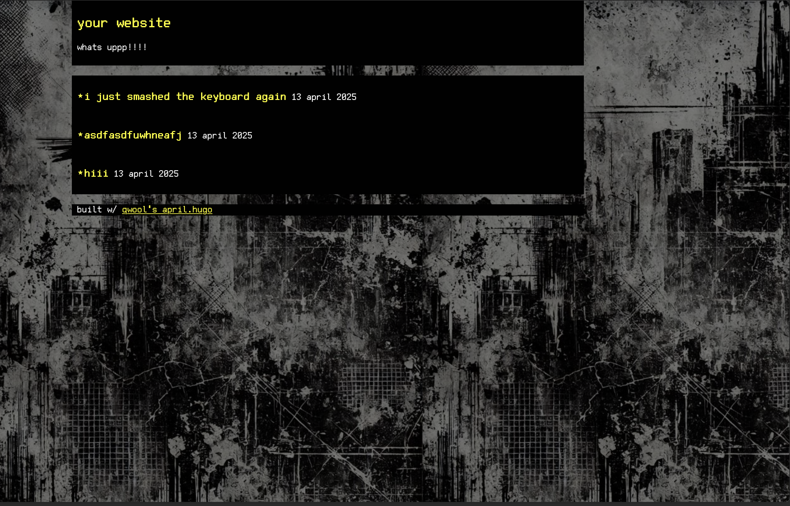

# qwool's fav hugo template

## why?
- supports relly niche features like plaintext posts through the unformatted flag in frontmatter and has a nice shortcode for music
- it looks really nice and bold
- i would be really happy if you were to use it

## how 2 use
1. clone it
2. put your own stuff into the content folder
3. run `hugo build` and take the files out of the `public`directory

if you're don't know anything about hugo but wanna learn it, watch [luke smith's video on it](https://www.youtube.com/watch?v=ZFL09qhKi5I)

